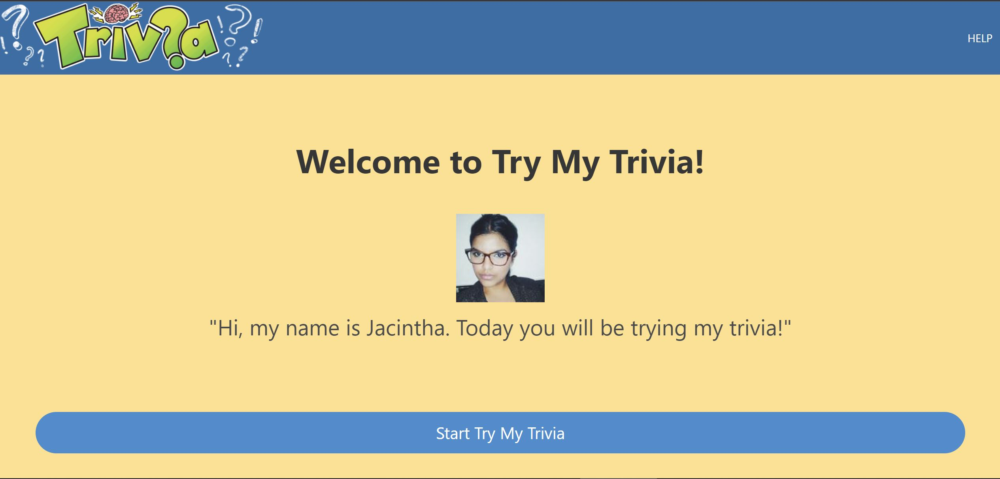
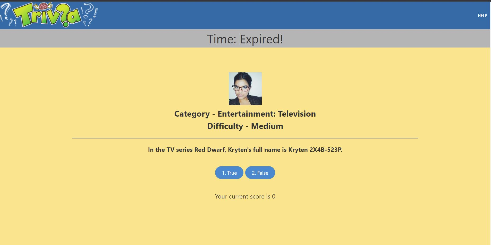
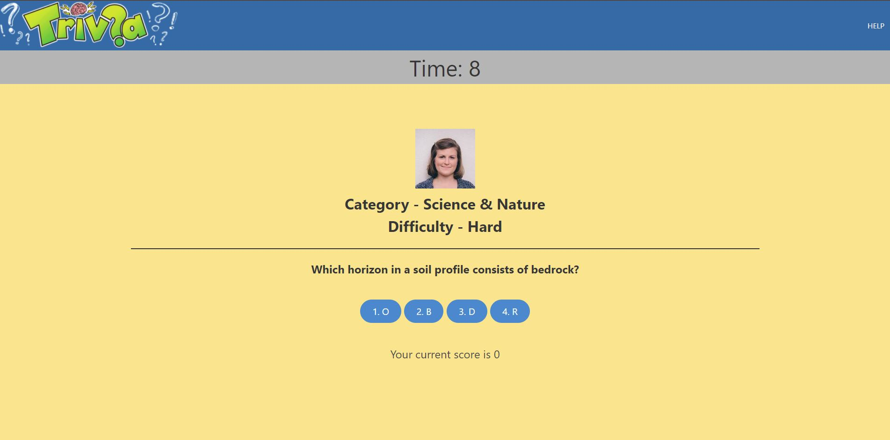
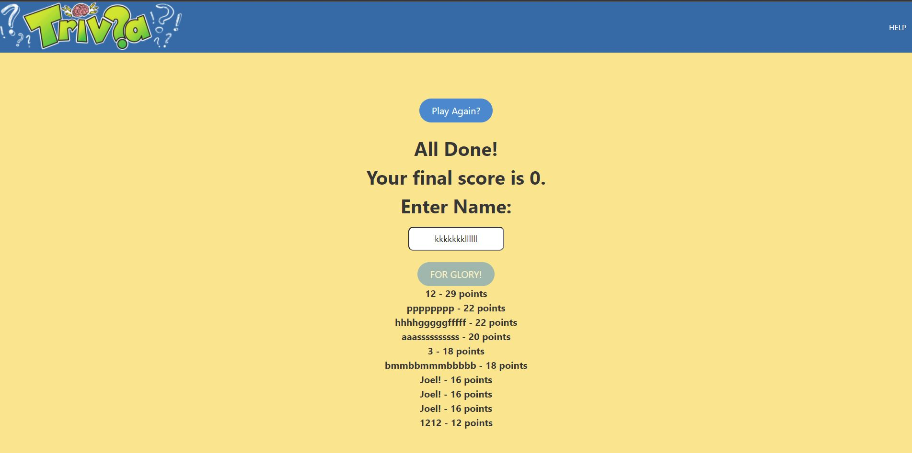

# TRY MY TRIVIA
Front End Group Project 1

## Description
In this trivia challenge users will put their knowledge to the test by attempting to complete a certain user's favorite 5 trivia questions. The questions range in difficulty anywhere from easy to hard and points will be awarded based on difficulty and how quickly you are able to answer.

-As a consumer,
 I want to play a fun engaging game that allows me to compete against my friends and family so that we can test our knowledge across a variety of topics

## Links
Repository:
https://github.com/JSplish/Try-My-Trivia

Deployed Link:
https://jsplish.github.io/Try-My-Trivia/

## Screenshots

## Website made using
* HTML
* CSS & Bulma CSS framework
* Javascript
* OpenTrivia API
* RandomUser API

## Made by
* Joel Cutler
* Rochelle Davis
* Micah Moore
* Dylan Lines
* Jordan Edginton
